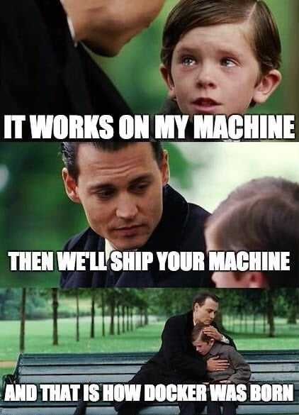

# Block 5: Docker (1 week)

[« Back to Index](../../README.md)

## Contents

**Docker** is a tool that can package software into containers that run reliably in any environment. But what is a container and why do you need one?

Let's imagine you built an app that runs on some weird version of linux. You want to share this out with your friend but he has an entirely different system. So the problem becomes how do we replicate the environment our software needs on any machine.

One way is using a virtual machine where the hardware is simulated then installed with the required OS and dependencies, but they tend to be bulky and slow.

Now, a docker container is conceptually very similar to a VM with one key difference. Instead of virtualizing hardware containers only virtualize the OS, or in other words, all apps and containers are run by a single kernel, and this makes almost everything faster and more efficient.

There are three fundamental elements in the universe of docker: the **docker file**, the **image** and the **container**.

1. The docker file is like DNA, it's just code that tells docker how to build an image which itself is a snapshot of your software along with all of it's dependencies down to the operating system level.

2. The image is immutable and it can be used to spin up multiple containers which is your actual software running in the real world.

3. The container, as mentioned before, is just a running process (like a Node application).

The whole point of docker is reproducing environments. The developer who creates the software can define the environment with a docker file. Then any developer at that point can use the docker file to rebuild the environment, which is saved as an image. Images can be uploaded into the cloud, then any developer or server that wants to run that software can pull the image down to create a container which is just a running process of that image.

## Resources

### Docker

- Oficial documentation: <https://docs.docker.com>.

## Tasks

- Read the first sections of Docker's oficial documentation (Part 1, 2, and 3, at least).
- Install the Docker Engine.
- Complete the challenges from [this repository](https://github.com/WeDevelop-ARG/training-program-docker-dev).
