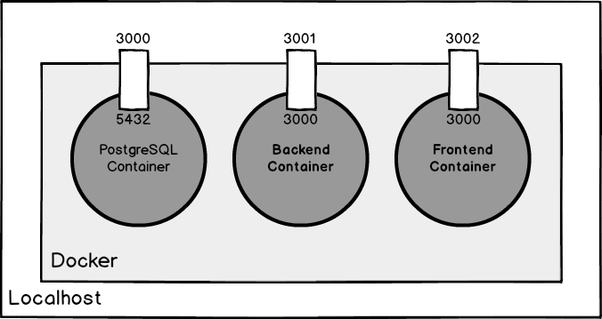

[« Back to Index](../../README.md)

# Block 5: Docker (1 week)

## Contents

- Docker

## Resources

### Docker
- Oficial documentation: https://docs.docker.com.

## Tasks
- Read the first sections of Docker's oficial documentation (Part 1, 2, and 3, at least).
- Install the Docker Engine.
- Dockerize the backend and frontend of your Chat system (create an image for each one, you'll need to write a Dockerfile for each one).
- Create a multi-container Docker application to run all of them simultaneously. Also, include *PostgreSQL* (https://hub.docker.com/_/postgres).
- Have in mind the following chart:

## Extra

- Deploy your application to *Amazon ECS*: https://aws.amazon.com/getting-started/tutorials/deploy-docker-containers.
